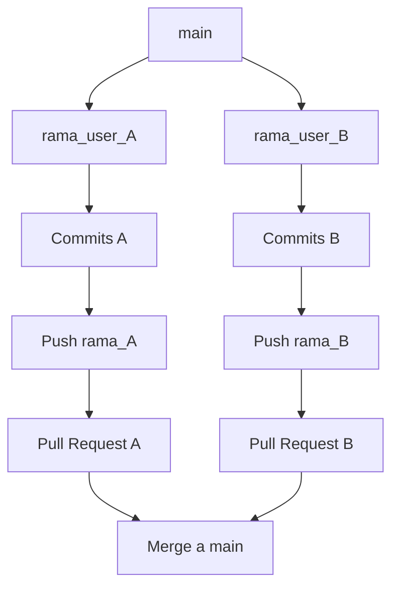
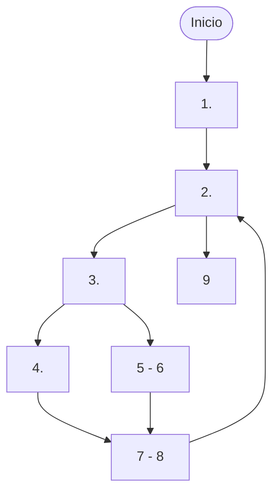
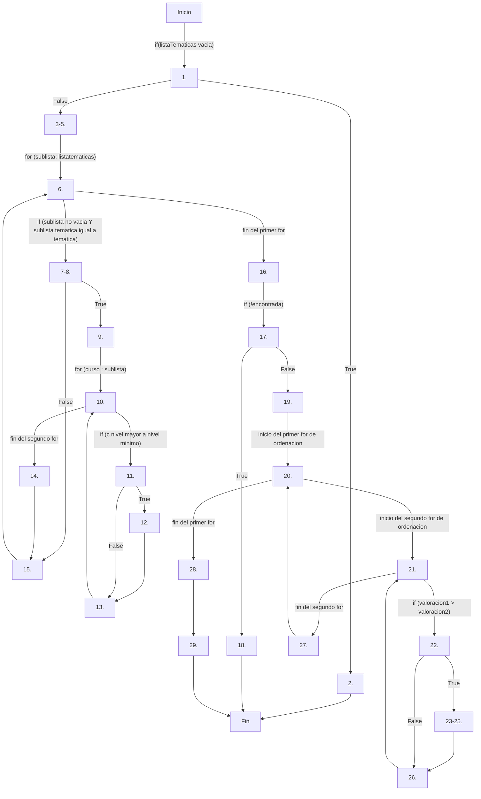
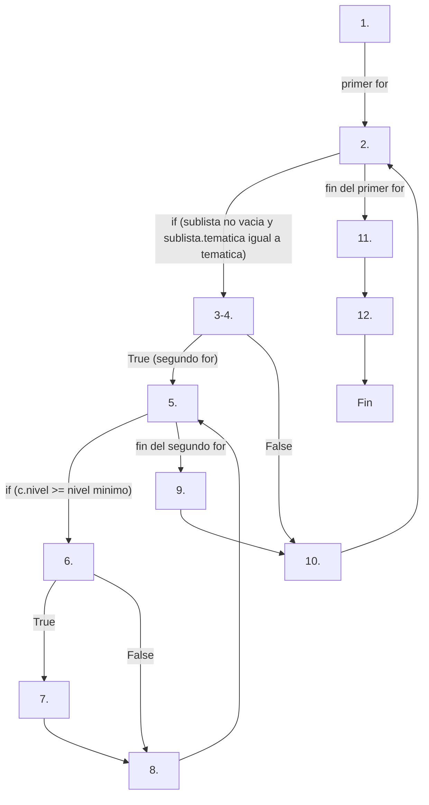
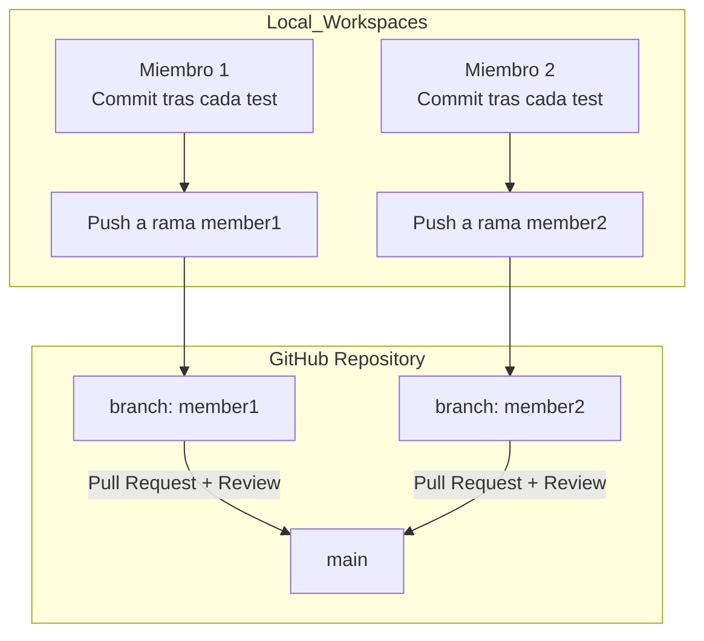
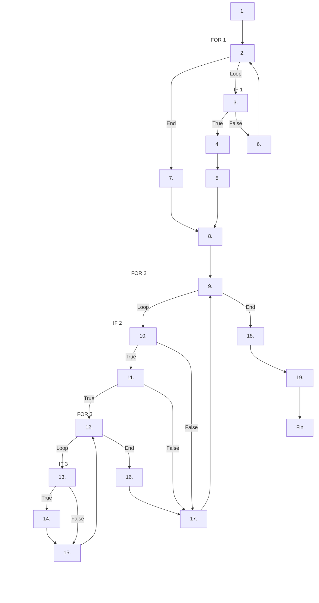
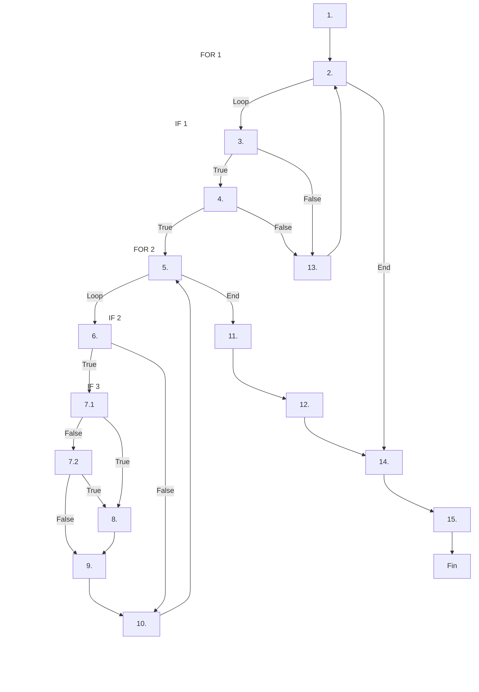

# Práctica 3  
## Técnicas de caja blanca para la generación de casos de prueba  

**Alumno 1**: Jesús Sánchez Pardo, <wjesus.sanchez@um.es>

**Alumno 2**: Jiahui Lin, <jiahui.lin@um.es>

**Curso 2025/2026 – Calidad del Software**

---

## Objetivos

- Dibujar el **grafo de flujo** y calcular la **complejidad ciclomática** de métodos seleccionados de la clase `ListaCursos`.  
- Generar **casos de prueba aplicando la técnica de caminos básicos** de caja blanca.
- Generar **casos de prueba aplicando la técnica de cubrimiento de condicionales**.
- Implementar los casos de prueba en **JUnit 5**.  
- Detectar **errores** en los métodos mediante pruebas unitarias.   

---

## Entorno de trabajo

- **Eclipse IDE 2025-06 (4.36.0)**  
  - Soporte integrado para **JUnit 5**, **Git** y **JDK >= 17**.  
  - Incluye el plugin **EclEmma Java Code Coverage 3.1.10**.  

### Nota importante
Si se usa el ordenador personal:  
- Verificar que está instalado **JDK 17 o superior**.  
- El proyecto Maven ya incluye dependencias de **JUnit 5** y **Hamcrest**.  
- Si no aparece *Coverage As >> JUnit Test*, instalar EclEmma desde:  
  - `Help > Eclipse Marketplace... > Buscar "EclEmma"`  

---

## Contexto

La plataforma **Formandera.com** organiza sus cursos por **temáticas**.  

La clase `ListaCursos` mantiene una **lista de listas** en la que:  
- Cada sublista corresponde a una temática.  
- Cada curso se representa con la clase `Curso` (atributos: nombre, temática, nivel y valoración).  

La clase `ListaCursos` dispone de los siguientes métodos a analizar y probar:  

- `buscarCursosPorNivel(String tematica, int nivelMinimo)`  
- `cursosPendientesPorTematica(List<Curso> realizados, String tematica)`  
- `buscarCursoMejorValorado(String tematica, int nivel)`  
- `contarCursosPorNivel(String tematica, int nivelMinimo)`   

---

## Forma de trabajo

Se creará un repositorio de **GitHub** con el nombre `CalSo2526_P3-grupoXX`, donde XX representará el número de grupo.

Cada miembro del grupo trabajará sobre su propia rama del repositorio de trabajo del grupo. 




En función del análisis inicial del código el grupo de trabajo se repartirá el código de análisis y se procederá a la elaboración de los grafos, identificación de la complejidad ciclomática, la identificción de caminos básicos, la propuesta de casos de prueba, tanto para la estrategia de caminos básicos como de cobertura de condicionales, y su respectiva documentación que se incorporará en un fichero `.md`. 

Cada participante, realizará un commit a su repositorio local cada vez que incorpore un artefacto nuevo a la práctica (gráfico, tablas de diseño, código de casos de prueba...) y al concluir cada sesión de trabajo realizarán un push a su rama. Cuando ambos miembros concluiyan con la resolución de todo el trabajo repartido se procederá a establecer los `pull request` necesarios para unificar todos las acciones en la rama `main` donde se configurará la entrega final.

---


## 1. **Dibujar el grafo de flujo** de cada método.
  - En la documentación usar un subapartado para cada uno de los métodos. Cada participante en su rama y al finalizar el trabajo en la rama `main`.

**Ejemplo**
    
  ```java
  1. int suma = 0;
  2. for (int i = 0; i < 5; i++) {
  3.     if (i % 2 == 0) {
  4.         suma += i;
  5.     } else {
  6.         suma -= i;
  7.     }
  8. }
  9. System.out.println(suma);
```



### `buscarCursosPorNivel`

Este método es el que mayor complejidad presenta de la clase `ListaCursos` debido a su flujo de ejecución:

- Al inicio, comprueba si `listaTematicas` se encuentra vacía. En caso afirmativo, el método finaliza al lanzar una excepción `IllegalStateException`, ya que no hay temáticas registradas. En caso contrario, continúa con la ejecución.
- Para cada temática de la lista, realiza lo siguiente:
  - Si la lista de cursos de la temática no se encuentra vacía **Y** su temática coincide con la que se busca (pasado como parámetro de la función), se ha encontrado la temática (asignando `true` a la variable `encontrada`) y se procede a comprobar el nivel para cada curso.
    - Si el nivel es mayor al mínimo requerido (pasado como parámetro de la función), se añade a la lista que devuelve el método.
    - En caso contrario, no hace nada.
  - Si estas dos condiciones no se cumplen, no se realiza nada y se pasa a la siguiente temática.
- Se comprueba si se ha encontrado la temática en la lista (`encontrada` es igual a `false`). En caso de que no sea así, el método finaliza lanzando una excepción `IllegalArgumentException`, ya que esta temática no existe en la lista. En caso afirmativo, continua su ejecución.
- A continuación, se procede a ordenar los cursos de manera ascendente por valoración mediante ordenación por burbuja-
- Finaliza devolviendo la lista de cursos ordenada.


    	
```java

public List<Curso> buscarCursosPorNivel(String tematica, int nivelMinimo) {

1    	if (listaTematicas.isEmpty()) {
2            throw new IllegalStateException("No existen temáticas registradas");
3        }
4        List<Curso> resultado = new ArrayList<>();
5        boolean encontrada = false;
6        for (List<Curso> sublista : listaTematicas) {
7           if (!sublista.isEmpty() &&
8               sublista.get(0).getTematica().equalsIgnoreCase(tematica)) {
9               	encontrada = true;
10                for (Curso c : sublista) {
11                    if (c.getNivel() > nivelMinimo) { 
12                        resultado.add(c);
13                    }
14                }
15            }
16        }
17        if (!encontrada) {
18            throw new IllegalArgumentException("La temática " + tematica + " no existe en la lista");
19        }     
20        for (int i = 0; i < resultado.size() - 1; i++) {
21            for (int j = 0; j < resultado.size() - i - 1; j++) {
22                if (resultado.get(j).getValoracion() > resultado.get(j + 1).getValoracion()) {
23                    Curso temp = resultado.get(j);
24                    resultado.set(j, resultado.get(j + 1));
25                    resultado.set(j + 1, temp);
26                }
27            }
28        }     
29        return resultado;
    }
```

El grafo del flujo es el siguiente:

 



### `contarCursosPorNivel`

  Para contar cuántos cursos existen en una temática a partir de un nivel, realiza lo siguiente:

  - Para cada sublista de las temáticas:
    - Comprueba si la sublista no está vacia **Y** coincide con la temática pasada como parámetro del método.
      - En caso afirmativo, para cada curso de la sublista, comprueba si tiene el nivel mínimo pasado como parámetro del método. Si es así, incrementa su contador de cursos.
      - En caso negativo, no realiza nada y continua con la siguiente sublista.
    - En caso contrario, finaliza el programa devolviendo el contador (igual a 0).


```java
public int contarCursosPorNivel(String tematica, int nivelMinimo) {
1.  int contador = 0;
2.  for (List<Curso> sublista : listaTematicas) { 
3.      if (!sublista.isEmpty() && 
4.          sublista.get(0).getTematica().equalsIgnoreCase(tematica)) {
5.          for (Curso c : sublista) { 
6.              if (c.getNivel() >= nivelMinimo) { 
7.                  contador++;
8.              }
9.          }
10.     }
11. }
12. return contador;
}
```

El grafo de este método es el siguiente:




## 2. **Calcular la complejidad ciclomática** de cada método, utilizando las trés fórmulas en cada uno de ellos. 

### `buscarCursosPorNivel`

La complejidad obtenida mediante las tres fórmulas es la siguiente:
- **Formula Arista/ Nodos: V(G) = E - N + 2**
  - Dado N=29 nodos y E=37 aristas, la complejidad ciclomática es igual a **V(G) = 37 - 29 + 2 = 10**.
- **Formula Predicados: V(G) = P + 1**
  - P es igual a nodos de decisión. Un nodo de decisión es aquel nodo que corresponde a una sentencia condicional en el código. 
  - En este método, los nodos que actúan como nodos de decisión son: 1, 6, 7-8, 10, 11, 17, 20, 21 y 22.
  - Dado P=9 nodos de decision, la compeljidad ciclomática es igual a **V(G) = 9 + 1 = 10**
- **Formula Regiones**
  - Las regiones se corresponden con áreas cerradas por nodos y arcos, incluyendo siempre el área exterior del grafo.
  - Las regiones se muestran en la siguiente imagen. Debido a la complejidad de este, algunas regiones se solapan por la representación de Mermaid. En total, son 10.
  
<p align="center">
    
</p>


### contarCursosPorNivel

La complejidad obtenida mediante las tres fórmulas es la siguiente:
- **Formula Arista/ Nodos: V(G) = E - N + 2**
  - Dado N=12 nodos y E=15 aristas, la complejidad ciclomática es igual a **V(G) = 15 - 12 + 2 = 5**.
- **Formula Predicados: V(G) = P + 1**
  - En este método, los nodos que actúan como nodos de decisión son: 2, 3-4, 5 y 6.
  - Dado P=4 nodos de decision, la compeljidad ciclomática es igual a **V(G) = 4 + 1 = 5**
- **Formula Regiones**
  - Las regiones se muestran en la siguiente imagen. En total, son 5 (incluyendo la región exterior).

  <p align="center">
    
</p>


## 3. **Identificar caminos básicos** y diseñar los casos de prueba correspondientes.  
   - Cada miembro del grupo deberá incorporar en el archivo `README.md` de **su rama personal**, para el subapartado, las tablas de casos de prueba.   
   - El formato de la tabla será:  

```markdown
| Camino básico | Nombre del caso                       | Entrada / Estado inicial                                               | Valor/Estado esperado                                                                                                 |
|---------------|---------------------------------------|-----------------------------------------------------------------|----------------------------------------------------------------------------------------------------------------|
| 1 → 2 → 4 → 6 | test_given_.......................... | Descripción del estado inicial y de los parámetros del método   | Descripción de los asserts a comprobar en función a la especificación o de la excepción que se debe capturar   |
|
```
  - Si alguno de los caminos no generara un caso de prueba se debe indicar en la tabla dicha imposibilidad y argumentar la justificación de la misma.
    


  ### `buscarCursosPorNivel`


| Camino básico (Según numeración de líneas) | Nombre del caso | Entrada / Estado inicial | Valor/Estado esperado |
|:--- |:--- |:--- |:--- |
| **1 (True) → 2 → Fin** | `test_given_listatematicas_empty_then_throw_IllegalStateException` | El atributo `listaTematicas` está vacía. | `IllegalStateException`. |
| **1 (False) → 3-5 → 6 → 7-8 (False) → 15 → 6 (fin del primer for) → 16 → 17 (True) → 18 → Fin** | `test_given_listatematicas_not_contains_tematica_then_throw_IllegalArgumentException` | `listaTematicas` no contiene el parámetro `tematica` especificado. | `IllegalArgumentException`. |
| **1 (False) → 3-5 → 6 → 7-8 (True) → 9 → 10 (fin del segundo for) → 14 → 15 → 6 (fin del primer for) → 16 → 17 (False) → 19 → 20 (fin del primer for) → 28 → 29 → Fin** | `test_given_listatematicas_contains_tematica_with_empty_sublist_courses_then_return_empty_list` | `listaTematicas` contiene la temática solicitada pero la sublista de cursos está vacía (sin entrar al segundo for). | Lista vacía. |
| **1 (False) → 3-5 → 6 → 7-8 (True) → 9 → 10 → 11 (False) → 13 → 10 (fin del segundo for) → 14 → 15 → 6 (fin del primer for) → 16 → 17 (False) → 19 → 20 (fin del primer for) → 28 → 29 → Fin** | `test_given_listatematicas_contains_tematica_and_sublist_with_not_minimum_course_level` | `listaTematicas` contiene la temática solicitada y la sublista no es vacía, pero ningún curso supera el nivel mínimo. | Lista vacía. |
| **1 (False) → 3-5 → 6 → 7-8 (True) → 9 → 10 → 11 (True) → 12 → 13 → 10 (fin del segundo for) → 14 → 15 → 6 (fin del primer for) → 16 → 17 (False) → 19 → 20 → 21 (fin del segundo for) → 27 → 20 (fin del primer for) → 28 → 29 → Fin** | `test_given_resultado_list_with_one_element_then_skip_bubble_sort_inner_loop` | La lista resultado tiene un solo elemento, no ejecuta el bucle interno de ordenación. | Lista con un elemento sin ordenar. |
| **1 (False) → 3-5 → 6 → 7-8 (True) → 9 → 10 → 11 (True) → 12 → 13 → 10 (fin del segundo for) → 14 → 15 → 6 (fin del primer for) → 16 → 17 (False) → 19 → 20 (fin del primer for) → 28 → 29 → Fin** | `test_given_listatematica_contains_tematica_and_sublist_with_minimum_course_level` | `listaTematicas` contiene la temática solicitada, una sublista no vacía y al menos un curso con el nivel mínimo. | Lista con los cursos de esa temática y al menos con el nivel mínimo. |
| **1 (False) → 3-5 → 6 → 7-8 (True) → 9 → 10 → 11 (True) → 12 → 13 → 10 (fin del segundo for) → 14 → 15 → 6 (fin del primer for) → 16 → 17 (False) → 19 → 20 → 21 → 22 (False) → 26 → 21 (fin del segundo for) → 27 → 20 (fin del primer for) → 28 → 29 → Fin** | `test_given_listatematica_contains_tematica_and_sublist_with_courses_with_same_valoracion` | `listaTematicas` tiene cursos con la misma valoración. | Lista de cursos con el orden especificado por la sublista. |
| **1 (False) → 3-5 → 6 → 7-8 (True) → 9 → 10 → 11 (True) → 12 → 13 → 10 (fin del segundo for) → 14 → 15 → 6 (fin del primer for) → 16 → 17 (False) → 19 → 20 → 21 → 22 (True) → 23-25 → 26 → 21 (fin del segundo for) → 27 → 20 (fin del primer for) → 28 → 29 → Fin** | `test_given_listatematica_contains_tematica_and_sublist_with_courses_with_different_valoracion` | `listaTematicas` tiene cursos con diferente valoración. | Lista de cursos con orden ascendente por valoración. |
| **1 (False) → 3-5 → 6 (L1) → 7-8 (False) → 15 → 6 (L2) → 7-8 (True) → 9 → 10 (fin del segundo for) → 14 → 15 → 6 (fin del primer for) → 16 → 17 (False) → 19 → 20 (fin del primer for) → 28 → 29 → Fin** | `test_given_listatematica_founds_tematica_at_second_loop_iteration` | `listaTematicas` encuentra la sublista temática en la segunda iteración. | Lista de cursos que superen el nivel mínimo. |
| **1 (False) → 3-5 → 6 (L1) → 7-8 (True) → 9 → 10 (L1) → 11 (True) → 12 → 13 → 10 (L2) → 11 (False) → 13 → 10 (fin del segundo for) → 14 → 15 → 6 (fin del primer for) → 16 → 17 (False) → 19 → 20 (fin del primer for) → 28 → 29 → Fin** | `test_given_listatematica_contains_tematica_and_sublist_with_courses_with_minimum_level_and_courses_with_not_minimum_level` | `listaTematicas` contiene cursos de la misma temática que superan el nivel mínimo pero otros no. | Lista con los cursos que superen el nivel mínimo. |

-----


### `contarCursosPorNivel`

| Camino básico (Según numeración de líneas) | Nombre del caso | Entrada / Estado inicial | Valor/Estado esperado |
|:--- |:--- |:--- |:--- |
| **1 → 2 (fin del primer for) → 11 → 12 → Fin** | `test_given_listatematicas_empty_then_return_zero` | El atributo `listaTematicas` está vacía. | `0`. |
| **1 → 2 → 3-4 (False) → 10 → 2 (fin del primer for) → 11 → 12 → Fin** | `test_given_listatematicas_not_contains_tematica_then_return_zero` | `listaTematicas` no contiene el parámetro `tematica` especificado. | `0`. |
| **1 → 2 → 3-4 (True) → 5 → 6 (False) → 8 → 5 (fin del segundo for) → 9 → 10 → 2 (fin del primer for) → 11 → 12 → Fin** | `test_given_listatematicas_contains_tematica_and_sublist_with_not_minimum_course_level` | `listaTematicas` contiene la temática solicitada y la sublista no es vacía, pero ningún curso supera el nivel mínimo. | `0`. |
| **1 → 2 → 3-4 (True) → 5 → 6 (True) → 7 → 8 → 5 (fin del segundo for) → 9 → 10 → 2 (fin del primer for) → 11 → 12 → Fin** | `test_given_listatematica_contains_tematica_and_sublist_with_minimum_course_level` | `listaTematicas` contiene la temática solicitada, una sublista no vacía y al menos un curso con el nivel mínimo. | Número de cursos que superan el nivel mínimo. |
| **1 → 2 → 3-4 (True) → 5 (L1) → 6 (True) → 7 → 8 → 5 (L2) → 6 (False) → 8 → 5 (fin del segundo for) → 9 → 10 → 2 (fin del primer for) → 11 → 12 → Fin** | `test_given_listatematica_contains_tematica_and_sublist_with_courses_with_minimum_level_and_courses_with_not_minimum_level` | `listaTematicas` contiene cursos de la misma temática que superan el nivel mínimo pero otros no. | Número de cursos que superan el nivel mínimo. |


## 4. **Implementar los casos de prueba** en `ListaCursosTest.java` usando JUnit 5 y reproduciendo el paquete de la clase objeto de la prueba en la carpeta de test.
  - Cada miembro del grupo deberá incorporar los casos de prueba en **su rama personal**. Con posterioridad deberán quedar unificados en la rama principal. 

## 5. Documentar en el `README.md` de cada rama los **errores detectados** en los métodos por los casos de prueba y corregir los errores encontrados.  
## 6. Argumentar, añadir, si fuera necesario, el dieño (usando una tabla parecida al ejercicio 3) y realizar la implementación de lso casos de prueba no contemplados en la tabla anterior que se obtengan mediante la técnica de **cobertura de condicionales** para el método `cursosPendientesPorTematica`. comprueba la vaidez con EclEmma, y añadir al `README.md` de la rama `main` un resumen con la documentación de los mismos.  

---

## Previo

- Crear un repositorio privado en **GitHub** con el nombre `CalSo2526_P3-grupoXX`.  
- Crear un **README.md** inicial con nombre, apellidos y correo UM de cada miembro.  
- Crear ramas personales siguiendo el esquema: *inicialesNombreApellidos_P3*.  



---

## Entregables

- En la tarea del Aula Virtual: enlace al repositorio GitHub que contenga:  
  - Proyecto Maven completo. 
  - Al inicio del fichero `README.md` pararecerá el nombre y correo electrónico de todos los miembros del equipo de trabajo. 
  - Documentación (en `README.md`) con grafos de flujo, complejidad ciclomática, diseño de casos de prueba usando la técnica de caminos básicos y cobertura de condicionales del método indicado en los ejercicios, implementación de los casos de prueba. Cada miembro realizará su trabajo en su rama y se unirá al finalizar todo el trabajo en la rama `main`.    
  - En `README.md` documentación de errores y cobertura.  

**Fecha de entrega:** 10/11/2025  

---

## Evaluación

- **Diagramas de flujo y complejidad ciclomática – 3.0 puntos**  
- **Casos de prueba de `ListaCursos` – 3.0 puntos**
- **Casos de prueba con la técnica de cobertura de condicionales y análisis de cobertura - 2.0 puntos**     
- **Documentación en README.md – 1.0 punto**  
- **Trabajo en ramas y PR – 1.0 punto**  

Total: **10 puntos**

## Análisis de `cursosPendientesPorTematica` - Jiahui

### Grafo de Flujo

```java
public List<Curso> cursosPendientesPorTematica(List<Curso> realizados, String tematica) {
1.  int maxNivel = 0;
2.  for (Curso c : realizados) { 
3.      if (c.getTematica().equalsIgnoreCase(tematica)) { 
4.          maxNivel = c.getNivel();
5.          break;
6.      }
7.  }
8.  List<Curso> pendientes = new ArrayList<>();
9.  for (List<Curso> sublista : listaTematicas) { 
10.     if (!sublista.isEmpty() && 
11.         sublista.get(0).getTematica().equalsIgnoreCase(tematica)) {
12.         for (Curso c : sublista) { 
13.             if (c.getNivel() > maxNivel) { 
14.                 pendientes.add(c);
15.             }
16.         }
17.     }
18. }
19. return pendientes;
}
```



### Complejidad Ciclomática (V(G))

  * **Fórmula 1 (Aristas/Nodos):** V(G) = E - N + 2

      * Nodos (N) = 20
      * Aristas (E) = 26
      * V(G) = 26 - 20 + 2 = **8**

  * **Fórmula 2 (Predicados):** V(G) = P + 1 (P = nodos de decisión)
    1.  `for (Curso c : realizados)` 
    2.  `if (c.getTematica().equalsIgnoreCase(tematica))`
    3.  `for (List<Curso> sublista : ...)`
    4.  `if (!sublista.isEmpty() && ...)`
    5.  `if (... && sublista.get(0).getTematica().equalsIgnoreCase)`
    6.  `for (Curso c : sublista)`
    7.  `if (c.getNivel() > maxNivel)`

    * V(G) = 7 + 1 = **8**

  * **Fórmula 3 (Regiones):** V(G) = 8
    [Ilustración](img/funcion2.jpg)

**Complejidad Ciclomática (V(G)) = 8**

### Caminos Básicos y Casos de Prueba

| Camino básico | Nombre del caso | Entrada / Estado inicial | Valor/Estado esperado |
| :--- | :--- | :--- | :--- |
| **1 → 2 (Fin) → 7 → 8 → 9 (Fin) → 18 → 19 → Fin** | test\_Pendientes\_SinRealizados\_SinCursos | `listaCursos` es un objeto `ListaCursos` vacío. `realizados` es un `ArrayList` vacío. `tematica = "Informatica"`. | `maxNivel` se mantiene en 0. El bucle `FOR(2)` no itera. El bucle `FOR(9)` no itera. Retorna `pendientes` (lista vacía). |
| **1 → 2 (Loop) → 3 (F) → 6 → 2 (Fin) → 7 → 8 → 9 (Fin) → 18 → 19 → Fin** | test\_Pendientes\_RealizadosOtraTematica\_SinCursos | `listaCursos` es un `ListaCursos` vacío. `realizados` contiene `[sociales1]` (temática "Sociales"). `tematica = "Informatica"`. | `maxNivel` se mantiene en 0 (el `IF(3)` es **Falso**). El bucle `FOR(2)` termina. El bucle `FOR(9)` no itera. Retorna `pendientes` (lista vacía). |
| **1 → 2 (Loop) → 3 (T) → 4 → 5 → 8 → 9 (Fin) → 18 → 19 → Fin** | test\_Pendientes\_RealizadosTematicaOk\_SinCursos | `listaCursos` es un `ListaCursos` vacío. `realizados` contiene `[info1]` (Nivel 1). `tematica = "Informatica"`. | `maxNivel` se establece en 1 (el `IF(3)` es **Cierto**) y el `break` (5) salta a (8). El bucle `FOR(9)` no itera. Retorna `pendientes` (lista vacía). |
| **1 → 2 (Fin) → 7 → 8 → 9 (Loop) → 10 (F) → 17 → 9 (Fin) → 18 → 19 → Fin** | test\_Pendientes\_SinRealizados\_TematicaConSublistaVacia | `listaCursos` contiene una sublista vacía para "Informatica" (creada con `addTematica`). `realizados = []`. | `maxNivel = 0`. El `FOR(9)` itera. El `IF(10)` (`!sublista.isEmpty()`) es **Falso**. Se salta a `17`. El `FOR(9)` termina. Retorna `pendientes` (lista vacía). |
| **1 → 2 (Fin) → 7 → 8 → 9 (Loop) → 10 (T) → 11 (F) → 17 → 9 (Fin) → 18 → 19 → Fin** | test\_Pendientes\_SinRealizados\_SublistaTematicaNoCoincide | `listaCursos` contiene `[sociales1]`. `realizados = []`. `tematica = "Informatica"`. | `maxNivel = 0`. El `FOR(9)` itera. `IF(10)` (`!isEmpty`) es **Cierto**. `IF(11)` (coincidencia de temática) es **Falso**. Se salta a `17`. Retorna `pendientes` (lista vacía). |
| **1 → 2 (Fin) → 7 → 8 → 9 (Loop) → 10 (T) → 11 (T) → 12 (Fin) → 16 → 17 → 9 (Fin) → 18 → 19 → Fin** | **(Camino No Factible)** | N/A | Justificación: Es una contradicción. Si `IF(10)` (`!sublista.isEmpty()`) es Cierto, la sublista tiene al menos un curso, por lo que el bucle `FOR(12)` *debe* iterar (no puede ir a `12(Fin)`). |
| **1 → 2 (Loop) → 3 (T) → 4 → 5 → 8 → 9 (Loop) → 10 (T) → 11 (T) → 12 (Loop) → 13 (F) → 15 → 12 (Fin) → ...** | test\_Pendientes\_RealizadoN1\_CursoN1\_NoAñade | `listaCursos` contiene `[info1(N1)]`. `realizados` contiene `[info1(N1)]`. `tematica = "Informatica"`. | `maxNivel = 1` (por el `break`). `FOR(12)` itera. `IF(13)` (`c.getNivel() > maxNivel`) evalúa `(1 > 1)` -> **Falso**. No se añade nada. Retorna lista vacía. |
| **1 → 2 (Loop) → 3 (T) → 4 → 5 → 8 → 9 (Loop) → 10 (T) → 11 (T) → 12 (Loop) → 13 (T) → 14 → 15 → 12 (Fin) → ...** | test\_Pendientes\_RealizadoN1\_CursoN2\_AñadeCurso | `listaCursos` contiene `[info2(N2)]`. `realizados` contiene `[info1(N1)]`. `tematica = "Informatica"`. | `maxNivel = 1` (por el `break`). `FOR(12)` itera. `IF(13)` (`c.getNivel() > maxNivel`) evalúa `(2 > 1)` -> **Cierto**. Se añade `info2` (Nodo 14). Retorna lista con `[info2]`. |

### Errores encontrados

#### Error 1

- __Error detectado__:  El método `cursosPendientesPorTematica` calcula incorrectamente el `maxNivel` de los cursos ya realizados.

- __Caso de prueba origen__:
`test_Pendientes_RealizadosDesordenados_DetectaMaxNivel`

- __Motivo del error__:
El bucle que itera sobre la lista `realizados` se detiene prematuramente por el `break`. En cuanto encuentra el *primer* curso que coincide con la temática, establece el `maxNivel` a ese valor e ignorando el resto de cursos de la lista.

**Modificación aplicada a la clase:**
Eliminar la sentencia `break` y modificar la lógica de asignación  para que busque el nivel máximo real.

```java
// Antes
public List<Curso> cursosPendientesPorTematica(List<Curso> realizados, String tematica) {
        int maxNivel = 0;

        for (Curso c : realizados) {
            if (c.getTematica().equalsIgnoreCase(tematica)) {
                maxNivel = c.getNivel();
                break; 
            }
        }

        List<Curso> pendientes = new ArrayList<>();
        for (List<Curso> sublista : listaTematicas) {
            if (!sublista.isEmpty() &&
                sublista.get(0).getTematica().equalsIgnoreCase(tematica)) {
                for (Curso c : sublista) {
                    if (c.getNivel() > maxNivel) {
                        pendientes.add(c); 
                    }
                }
            }
        }
        return pendientes;
    }
// Después
public List<Curso> cursosPendientesPorTematica(List<Curso> realizados, String tematica) {
    int maxNivel = 0;

    for (Curso c : realizados) {
        if (c.getTematica().equalsIgnoreCase(tematica)) {
            if (c.getNivel() > maxNivel) { // <-- CORRECCIÓN
                maxNivel = c.getNivel(); // <-- CORRECCIÓN
            }
            // break;
        }
    }
    List<Curso> pendientes = new ArrayList<>();
        for (List<Curso> sublista : listaTematicas) {
            if (!sublista.isEmpty() &&
                sublista.get(0).getTematica().equalsIgnoreCase(tematica)) {
                for (Curso c : sublista) {
                    if (c.getNivel() > maxNivel) {
                        pendientes.add(c); 
                    }
                }
            }
        }
        return pendientes;
}
```

### Cobertura de Condicionales

| Camino básico | Nombre del caso | Entrada / Estado inicial | Valor/Estado esperado |
| :--- | :--- | :--- | :--- |
| Condición 1er Bucle | `test_Condicion_MaxNivel_RealizadosN1_N1bis` | **Caso `==` (Falso):** `realizados = [info1, info1_1]` (dos cursos N1). `listaCursos` vacía. `tematica = "Informatica"`. | `maxNivel` se pone a 1. En el 2º elem, `(1 > 1)` es falso. El resultado es una lista vacía. `assertTrue(resultado.isEmpty())`. |
| Condición 1er Bucle | `test_Condicion_MaxNivel_RealizadosN2_N1` | **Caso `<` (Falso):** `realizados = [info2, info1]` (N2 y N1, en desorden). `listaCursos` vacía. `tematica = "Informatica"`. | `maxNivel` se pone a 2. En el 2º elem, `(1 > 2)` es falso. El resultado es una lista vacía. `assertTrue(resultado.isEmpty())`. |

Estos dos tests son necesarios para lograr la **Cobertura de Condicionales** en el *primer* bucle del método, donde se calcula el `maxNivel`:

`if (c.getNivel() > maxNivel)`

La técnica de pruebas de condición en este caso requiere probar los tres casos lógicos de `>`:

1.  `E1 > E2`
2.  `E1 == E2`
3.  `E1 < E2`

En los tests anteriores ya se cubrían el **Caso 1 (`>`)**. De modo que es necesario incluir los siguientes:

* **`test_Condicion_MaxNivel_RealizadosN1_N1bis`**: Prueba el **Caso 2 (`==`)**.
    * Fuerza la comprobación `(1 > 1)` en la segunda iteración, que es **Falso**.
* **`test_Condicion_MaxNivel_RealizadosN2_N1`**: Prueba el **Caso 3 (`<`)**.
    * Fuerza la comprobación `(1 > 2)` en la segunda iteración, que es **Falso**.

De esta forma nos aseguramos una cobertura del 100% de la función.


------

## Análisis de `buscarCursoMejorValorado` - Jiahui

### Grafo de Flujo

```java
public Curso buscarCursoMejorValorado(String tematica, int nivel) {
1.  Curso mejor = null;
2.  for (List<Curso> sublista : listaTematicas) {
3.      if (!sublista.isEmpty() &&
4.          sublista.get(0).getTematica().equalsIgnoreCase(tematica)) {
5.          for (Curso c : sublista) { 
6.              if (c.getNivel() == nivel) { 
7.                  if (mejor == null || c.getValoracion() > mejor.getValoracion()) { 
8.                      mejor = c;
9.                  }
10.             }
11.         }
12.         break;
13.     }
14. }
15. return mejor;
}
```



### Complejidad Ciclomática (V(G))

  * **Fórmula 1 (Aristas/Nodos):** V(G) = E - N + 2

      * Nodos (N) = 17
      * Aristas (E) = 23
      * V(G) = 23 - 17 + 2 = **8**

  * **Fórmula 2 (Predicados):** V(G) = P + 1 (P = nodos de decisión)
    1.  `for (List<Curso> sublista : ...)`
    2.  `if (!sublista.isEmpty() && ...)`
    3.  `if ( ... && sublista.get(0).getTematica().equalsIgnoreCase(tematica))`
    4.  `for (Curso c : sublista)`
    5.  `if (c.getNivel() == nivel)`
    6.  `if (mejor == null || ...)`
    7.  `if (... || c.getValoracion() > mejor.getValoracion())`

    * V(G) = 7 + 1 = **8**

  * **Fórmula 3 (Regiones):** V(G) = 8
    [Ilustración](img/funcion3.jpg)

**Complejidad Ciclomática (V(G)) = 8**

### Caminos Básicos y Casos de Prueba

| Camino básico | Nombre del caso | Entrada / Estado inicial | Valor/Estado esperado |
| :--- | :--- | :--- | :--- |
| **1 → 2 (Fin) → 14 → 15 → Fin** | test\_MejorValorado\_ListaVacia | `listaCursos = new ListaCursos()`. `tematica="Info"`, `nivel=1`. | El bucle `FOR(2)` (`listaTematicas`) no itera. `mejor` (inicializado a `null`) no cambia. Retorna `null`. |
| **1 → 2 (Loop) → 3 (F) → 13 → 2 (Fin) → 14 → 15 → Fin** | test\_MejorValorado\_TematicaRegistradaPeroVacia | `listaCursos.addTematica("Informatica")` (crea `[ [] ]`). `tematica="Informatica"`. | `FOR(2)` itera. `IF(3)` (`!isEmpty`) es **Falso**. Se salta a `13`. `FOR(2)` termina. Retorna `null`. |
| **1 → 2 (Loop) → 3 (T) → 4 (T) → 5 (Fin) → 11 → 12 → 14 → 15 → Fin** | **(Camino No Factible)** | N/A | Justificación: Si `IF(3)` (`!sublista.isEmpty()`) es Cierto, el bucle `FOR(5)` (`for (Curso c : sublista)`) debe ejecutarse al menos una vez. |
| **1 → 2 (Loop) → 3 (T) → 4 (T) → 5 (Loop) → 6 (F) → 10 → 5 (Fin) → 11 → 12 → 14 → 15 → Fin** | test\_MejorValorado\_TematicaOk\_NivelNoEncontrado | `listaCursos` tiene `[info1(N1, V4)]`. Se busca `tematica="Informatica"`, `nivel=99`. | `3(T)`, `4(T)`. `FOR(5)` itera. `IF(6)` (`c.getNivel() == 99`) es **Falso**. `FOR(5)` termina. Se ejecuta `break(12)`. Retorna `null`. |
| **1 → 2(L) → 3(T) → 4(T) → 5(L) → 6(T) → 7.1(F) → 7.2(F) → 9 → 10 → 5(E) → 11 → 12 → 14 → 15 → Fin** | test\_MejorValorado\_TematicaOk\_EncuentraPeorValoracion | `listaCursos` tiene `[info2(N2, V5), info2_bis(N2, V3)]`. Se busca `nivel=2`. | 1ª iter `FOR(5)` (`info2`): `6(T)`, `7.1(T)`, `mejor = info2`. 2ª iter (`info2_bis`): `6(T)`, `7.1(F)` (`mejor != null`), `7.2(F)` (`3 > 5` es Falso). `FOR(5)` termina. `break(12)`. Retorna `info2`. |
| **1 → 2 (L) → 3 (T) → 4 (T) → 5 (L) → 6 (T) → 7.1 (T) → 8 → 9 → 10 → 5 (E)→ 11 → 12 → 14 → 15 → Fin** | test\_MejorValorado\_TematicaOk\_UnicoCursoCoincide | `listaCursos` tiene `[info2(N2, V5)]`. Se busca `nivel=2`. | `3(T)`, `4(T)`. 1ª iter `FOR(5)` (`info2`): `IF(6)` es **Cierto**. `IF(7.1)` (`mejor == null`) es **Cierto**. `mejor` se asigna a `info2` (Nodo 8). `FOR(5)` termina. `break(12)`. Retorna `info2`. |
| **(Nuevo)** `1 → 2 (L) → 3 (T) → 4 (F) → 13 → 2 (E) → 14 → 15 → Fin` | test\_MejorValorado\_TematicaNoEncontrada\_OtrasTematicasPresentes | `listaCursos` contiene `[sociales1]`. Se busca `tematica="Informatica"`. | `FOR(2)` itera. `IF(3)` (`!isEmpty`) es **Cierto**. `IF(4)` (`tematica == "Informatica"`) es **Falso**. Se salta a `13`. `FOR(2)` termina. Retorna `null`. |
| **(Nuevo)** `1 → 2(L) → 3(T) → 4(T) → 5(L) → 6(T) → 7.1(F) → 7.2(T) → 8 → 9 → 10 → 5(E) → 11 → 12 → 14 → 15 → Fin` | test\_MejorValorado\_TematicaOk\_EncuentraMejorValoracion | `listaCursos` tiene `[info2_bis(N2, V3), info2(N2, V5)]`. Se busca `nivel=2`. | 1ª iter `FOR(5)` (`info2_bis`): `6(T)`, `7.1(T)`, `mejor = info2_bis`. 2ª iter (`info2`): `6(T)`, `7.1(F)`, `7.2(T)` (`5 > 3` es Cierto). `mejor` se actualiza a `info2` (Nodo 8). `FOR(5)` termina. `break(12)`. Retorna `info2`. |

#### Caminos contradictorios
- Camino 3: Para que la condición (3,4) sea verdadera (T), `!sublista.isEmpty()` debe ser verdadera. Si la sublista no está vacía, el bucle `for` (5) debe ejecutarse al menos una vez, lo que contradice `5 (Fin)`.

- Camino 5: En la primera iteración del bucle (5) que cumple la condición (6), `mejor` es `null`. Por lo tanto, la condición (7) `(mejor == null \|\| ...)` siempre será verdadera (T) en esa primera iteración. Es imposible que sea falsa (F).